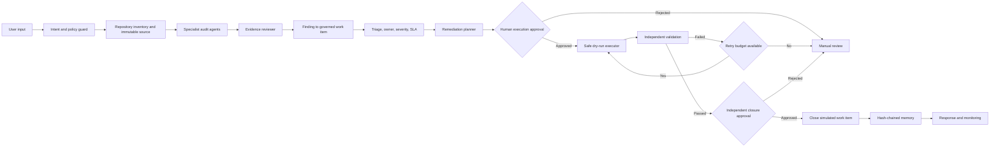
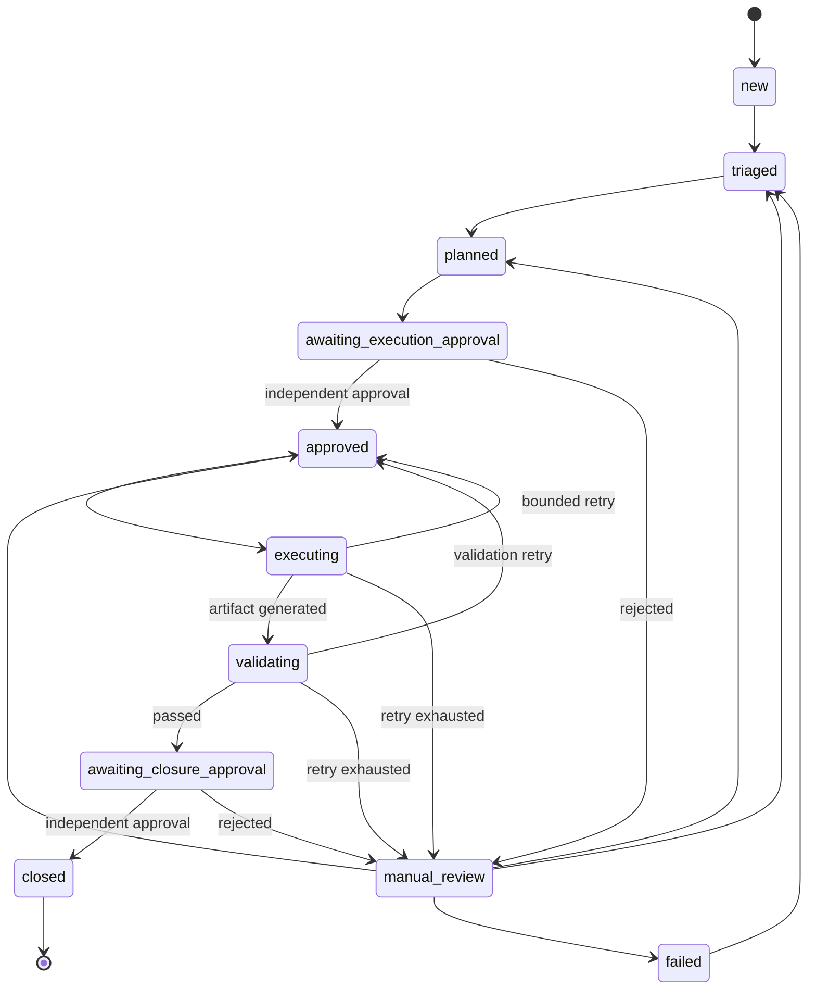

# Agentic Engineering Control Plane

A standalone, governed control plane for auditing every repository owned by
[`SuriyaBoon`](https://github.com/SuriyaBoon) and carrying accepted findings
through a controlled work lifecycle.

The system covers repository inventory, intent/policy validation, planning,
agent routing, bounded tool selection, dry-run execution, independent
validation, approval-gated closure, persistent event memory, response
generation, and monitoring.

Source repositories remain read-only. This portfolio/lab system demonstrates
the complete governed workflow without claiming autonomous production
remediation.

## Verified scope

- Inventory snapshot: 24 repositories (20 public, 4 private).
- Public repositories can be audited without credentials.
- Private repositories require a read-only `GITHUB_TOKEN`; otherwise they are
  recorded as `auth_required`, never silently omitted.
- Eight audit agents plus an evidence reviewer.
- Governed work-item state machine with SLA, bounded retry, and manual fallback.
- Independent execution approval, executor, validator, and closure approver.
- SQLite operational memory with an append-only SHA-256 event chain.
- Dry-run remediation artifacts only; no source mutation or production action.
- Deterministic operation without an LLM or third-party Python package.

## End-to-end flow



## Ten-stage Agentic Engineering mapping

| Stage | Implementation | Output |
|---|---|---|
| User Input | CLI commands and explicit actor identities | Validated command |
| Intent Understanding | Policy guard and allowed mode checks | Allowed/denied intent |
| Task Planning | `RemediationPlanner` | Versioned remediation plan |
| Agent Routing | Audit agent selection plus lifecycle role routing | Assigned agent/role |
| Tool Selection | `ToolRegistry` with enabled and disabled boundaries | Safe tool decision |
| Execution | `SafeExecutor` in `dry_run`/`mock` only | Hashed execution artifact |
| Validation | Evidence reviewer and independent execution validator | Pass/fail with reasons |
| Memory Update | SQLite state plus SHA-256 chained events | Tamper-evident history |
| Response Generation | JSON/Markdown reports and CLI responses | Human-readable evidence |
| Monitoring | State, severity, overdue, retry, and integrity metrics | Operational status |

## State machine



`closed` means the governed **simulation work item** completed with verified
evidence. It does not assert that the source repository was changed or that the
underlying production risk was remediated.

## Roles

| Role/agent | Responsibility | Separation rule |
|---|---|---|
| Intent guard | Reject policy-violating requests | Fails closed |
| Audit agents | Detect architecture, workflow, security, test, CI, documentation, integration, and governance gaps | Read-only |
| Evidence reviewer | Reject findings without scanned-file or metadata evidence | Independent from detectors |
| Triage lead | Confirm owner and SLA | Cannot close work |
| Planner | Produce steps, tool, validation, retry, and fallback | Cannot approve own plan |
| Execution approver | Approve/reject execution | Cannot execute |
| Safe executor | Generate a dry-run artifact | Cannot validate own output |
| Validator | Verify artifact/hash/guardrails | Cannot close work |
| Closure approver | Approve/reject closure | Must not be a prior lifecycle actor |
| Memory/monitor | Record hash-chained history and operational metrics | No mutation authority |

## Quick start

Requires Python 3.11 or newer.

```powershell
python -m ae_control_plane.cli doctor
python -m ae_control_plane.cli agents
python -B -m unittest discover -v -s tests
```

Audit every available repository and create governed work items:

```powershell
python -m ae_control_plane.cli audit-all `
  --source-root C:\path\to\repositories `
  --download-missing `
  --live-inventory `
  --create-work-items
```

An existing audit run can be ingested idempotently:

```powershell
python -m ae_control_plane.cli workflow-ingest `
  --run-root C:\path\to\runs\<run-id>
```

## Governed lifecycle commands

Use distinct human/agent actor names. The system enforces separation of duties.

```powershell
python -m ae_control_plane.cli work-list --state new

python -m ae_control_plane.cli work-triage `
  --work-item-id WORK-... `
  --actor triage-lead `
  --owner repository-owner

python -m ae_control_plane.cli work-plan `
  --work-item-id WORK-... `
  --actor remediation-planner

python -m ae_control_plane.cli work-approve `
  --work-item-id WORK-... `
  --stage execution `
  --decision approved `
  --actor change-approver `
  --comment "Reviewed for dry-run execution"

python -m ae_control_plane.cli work-execute `
  --work-item-id WORK-... `
  --actor safe-executor

python -m ae_control_plane.cli work-validate `
  --work-item-id WORK-... `
  --actor independent-validator

python -m ae_control_plane.cli work-approve `
  --work-item-id WORK-... `
  --stage closure `
  --decision approved `
  --actor risk-owner `
  --comment "Simulation evidence independently verified"

python -m ae_control_plane.cli work-show --work-item-id WORK-...
python -m ae_control_plane.cli monitor
```

## Private repositories

Create a fine-grained token with read-only Contents and Metadata access only:

```powershell
$env:GITHUB_TOKEN = "<read-only fine-grained token>"
python -m ae_control_plane.cli audit-all `
  --download-missing `
  --live-inventory `
  --create-work-items
Remove-Item Env:GITHUB_TOKEN
```

The token is never written to reports or workflow memory.

## Runtime outputs

Runtime data defaults to `%TEMP%\agentic-engineering-control-plane`:

```text
runs/<UTC-run-id>/
|-- inventory.json
|-- manifest.json
|-- portfolio.json
|-- portfolio.md
`-- repositories/
    |-- SuriyaBoon__Example.json
    `-- SuriyaBoon__Example.md

workflow/
|-- workflow.db
`-- executions/
    `-- WORK-.../
        `-- attempt-1.json
```

## Retry and fallback

- Maximum attempts are configured in `config/policy.json`.
- Execution or validation failure returns to `approved` while budget remains.
- Exhausted attempts move to `manual_review`.
- Rejected execution or closure also moves to `manual_review`.
- Invalid state transitions, self-approval, missing evidence, disabled tools,
  artifact tampering, and source-mutation plans fail closed.

## Monitoring

`monitor` returns:

- work items by state and severity;
- overdue count and identifiers;
- event count and event-chain integrity;
- explicit `production_execution=false`;
- explicit `source_repository_mutation=false`.

The CLI is suitable for a scheduler or CI job, but the repository does not
install a background service or silently schedule work on the user's machine.

## Safety boundary

The following tools exist only as disabled boundaries:

- `github_draft_pr`
- `live_infrastructure_action`

The active `mock_remediation` tool writes a proposal artifact outside source
repositories. It cannot commit, push, create PRs/issues, deploy, modify AD/VMs,
perform restore operations, accept organizational risk, or claim production
remediation.

Repository content is treated as untrusted data rather than instructions.
Snapshot paths and compressed/uncompressed sizes are validated, and scans are
bounded by file and byte limits.

## Validation

```powershell
python -B -m unittest discover -v -s tests
python -m ae_control_plane.cli doctor
python -m ae_control_plane.cli monitor
```

CI runs all tests and parses every committed JSON document.

See [`docs/AGENTIC-WORKFLOW.md`](docs/AGENTIC-WORKFLOW.md) for decision rules,
inputs/outputs, approval points, error handling, metrics, and pseudocode.
