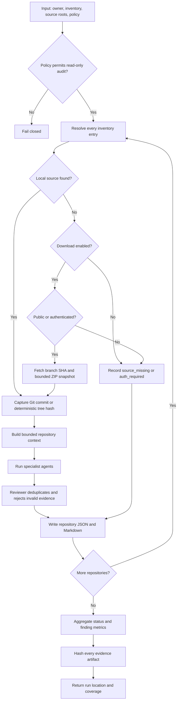

# Agentic Engineering Control Plane

A standalone, read-only control plane for auditing every repository owned by
[`SuriyaBoon`](https://github.com/SuriyaBoon). It turns repository source into
repeatable architecture, workflow, security, testing, CI, documentation,
integration, and governance findings, then sends those findings through an
independent reviewer before producing hashed evidence.

This repository does **not** modify, push to, deploy, or operate any audited
repository. It is a portfolio/lab assurance system, not an autonomous
production remediation platform.

## Current scope

- Inventory snapshot: 23 repositories (19 public, 4 private).
- Public repositories can be audited without credentials.
- Private repositories require a read-only `GITHUB_TOKEN`; without it, they are
  recorded as `auth_required` rather than silently omitted.
- Analysis is deterministic and works without an LLM/API key.
- Every repository receives a result, including unavailable or failed sources.
- Every accepted finding must reference a scanned file or explicit metadata.
- Every run contains per-repository JSON/Markdown, portfolio summaries, the
  inventory used, and a SHA-256 evidence manifest.

## High-level flow

```mermaid
flowchart LR
    U["Audit request"] --> I["Inventory and intent validation"]
    I --> P["Read-only plan"]
    P --> R["Repository routing"]
    R --> S["Local source or immutable GitHub snapshot"]
    S --> A["Specialist audit agents"]
    A --> V["Independent evidence reviewer"]
    V --> E["Per-repository evidence"]
    E --> O["Portfolio report and SHA-256 manifest"]
    O --> M["Metrics and next-run monitoring"]
```



## Detailed flow



## Agent roles

| Agent | Responsibility | Key output |
|---|---|---|
| Architecture | Purpose, entrypoints, layers, and data-flow documentation | Architecture gaps |
| Workflow | Lifecycle, retry, fallback, rollback, and manual review | Workflow-control gaps |
| Security | Secrets, unsafe execution, merge conflicts, and live-action boundaries | Security findings |
| Testing | Automated tests and negative-control coverage | Test assurance gaps |
| CI | Workflow presence and least-privilege permissions | CI findings |
| Documentation | Reproducibility, claim integrity, and production boundaries | Documentation findings |
| Integration | Versioned connectors, schemas, and contract tests | Integration gaps |
| Governance | Owner, approval, evidence, verification, and closure | Governance findings |
| Reviewer | Evidence validation, deduplication, and limitations | Accepted findings |
| Orchestrator | Inventory coverage, routing, isolation, reports, and metrics | Complete audit run |

## Quick start

Requires Python 3.11 or newer and has no third-party runtime dependencies.

```powershell
python -m ae_control_plane.cli doctor
python -m ae_control_plane.cli agents
```

Audit local repositories without network access:

```powershell
python -m ae_control_plane.cli audit-all `
  --source-root C:\path\to\repositories
```

Audit all public repositories, using local copies first and immutable GitHub
snapshots for anything missing:

```powershell
python -m ae_control_plane.cli audit-all `
  --source-root C:\path\to\repositories `
  --download-missing `
  --live-inventory
```

To include private repositories, create a fine-grained token with read-only
Contents and Metadata access for the selected repositories, expose it only to
the current process, and rerun the same command:

```powershell
$env:GITHUB_TOKEN = "<read-only fine-grained token>"
python -m ae_control_plane.cli audit-all --download-missing --live-inventory
Remove-Item Env:GITHUB_TOKEN
```

Never commit the token. The system does not write it to reports.

## Outputs

By default, runtime data is outside this Git repository:
`%TEMP%\agentic-engineering-control-plane`.

```text
runs/<UTC-run-id>/
├── inventory.json
├── manifest.json
├── portfolio.json
├── portfolio.md
└── repositories/
    ├── SuriyaBoon__Example.json
    └── SuriyaBoon__Example.md
```

`status` distinguishes `audited`, `source_missing`, `auth_required`,
`unavailable`, and `error`. A clean finding list only means that the current
rules found no issue in the scanned context; it is not a certification.

## Guardrails and human approval

The policy in [`config/policy.json`](config/policy.json) fails closed unless
`mode` is `read_only_audit` and source mutation is disabled.

Human approval is required before any future capability that would:

- change source, create commits, push, open a PR/issue, or alter repository settings;
- execute AD, VM, backup/restore, containment, or deployment actions;
- accept risk, close findings, send external messages, or expose private evidence.

Those operations are deliberately not implemented in this release.

Repository content is treated as untrusted data, never as executable
instructions. Snapshot paths and compressed/uncompressed sizes are validated;
scans are bounded by file and byte limits.

## Metrics

Each run records inventory coverage, status counts, findings by severity,
reviewer state, file/source/test/workflow/manifest counts, scan truncation, and
source identity. These metrics support trend comparison without claiming that a
rule-based scan replaces penetration testing, code review, or compliance audit.

## Validation

```powershell
python -B -m unittest discover -v -s tests
python -m ae_control_plane.cli doctor
```

CI repeats the unit suite and validates every committed JSON document.

## Extension boundary

Additional agents may be added behind the same `AuditAgent` interface. An LLM
provider can later propose findings, but proposals must still pass the
deterministic evidence reviewer and the same policy boundary. Remediation should
remain a separate, approval-gated workflow rather than being added to this
read-only audit path.
