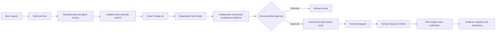
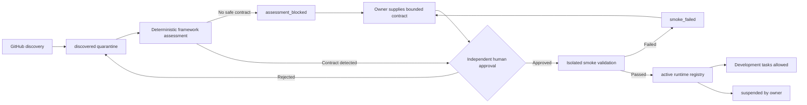

# Governed cross-repository development protocol

## Scope

This protocol controls how an agent changes an explicitly registered
repository. It is external development tooling, not an application component
of SentinelGRC or any supporting repository.

The original checkout is never edited. The controller creates a per-task clone,
captures the base commit, creates a generated branch, and stops at a human gate
before any GitHub write. A successful gate permits only a task-branch push and
a draft pull request. The controller has no merge or deployment operation.

## High-level flow



## Detailed decision contract

| Step | Agent/role | Input | Output | Decision and fallback |
|---|---|---|---|---|
| User input | Requester | Repo, intent, acceptance criteria | Development task | Reject empty intent/criteria |
| Intent understanding | Intent guard | Intent and owner policy | Risk class | Critical remains governed; production action stays blocked |
| Task planning | Planner | Task and policy | Bounded plan | Route failure to manual review |
| Agent routing | Controller | State and plan | Next independent role | Reject invalid transitions |
| Tool selection | Policy guard | Repo/test contract | Allowed argument arrays | Unknown executable or missing contract fails closed |
| Workspace | Workspace manager | Registered repo/base | Isolated clone, source SHA, task branch | Clone/base failure stops without source mutation |
| Execution | Coder | JSON change set | Workspace diff | Reject traversal, `.git`, size/line/file budgets |
| Validation | Test runner | Registered commands | Exit code/stdout/stderr | Failure enters bounded repair |
| Review | Independent reviewer | Diff, tests, criteria | Review record and change digest | Secret, missing evidence, changed budget, or failed tests rejects |
| Approval | Human repo owner | Reviewed task | Publish approval record | Exact `APPROVE DEV-*` required |
| Publication | Publisher | Approved immutable diff | Commit, branch push, draft PR | Default-branch push and non-draft PR are impossible |
| Verification | Post-merge verifier | GitHub PR/checks | Merge evidence | Incomplete/failing checks do not close |
| Memory | Event/evidence agent | Every transition | SHA-256 chain and manifest | Tampering is surfaced |
| Monitoring | Monitor | All task states | Counts and integrity status | Manual-review work remains visible |

## Agent roles

| Agent | Authority | Cannot do |
|---|---|---|
| Intent guard | Validate owner, intent, criteria, risk | Modify code |
| Planner | Produce bounded workflow | Approve publication |
| Workspace manager | Clone and create task branch | Edit original checkout |
| Coder | Apply an explicit JSON change set | Test, review, approve, push |
| Test runner | Run registered allowlisted commands | Review own execution |
| Security reviewer | Detect likely committed secrets | Accept exceptions |
| Independent reviewer | Verify diff, budgets, tests, criteria | Be coder or test runner |
| Human publish approver | Authorize reviewed branch/PR scope | Authorize merge/deploy implicitly |
| Publisher | Commit, push generated branch, create draft PR | Push default branch or merge |
| Post-merge verifier | Inspect merge and check runs | Merge or rerun production |
| Memory monitor | Preserve and report evidence | Change target repository |

## Registered repositories

`config/repositories.json` contains the current ecosystem. Repository metadata
was checked against GitHub on 2026-07-28. The live default branch for
`JML-Automation` is `agent/jml-mvp`, and the actual SOC repository is
`SOC-Homelab-Elastic-Stack-security-monitoring`.

Executable test or static-validation contracts are configured for all ten.
The Windows labs use PowerShell parser validation without executing the lab
scripts. The SOC repository uses its documented configuration validator.
Python repositories use their documented unittest or pytest entry points.
Missing dependencies or tests fail the gate; they never count as success.

## New repository onboarding

A repository discovered later is not trusted or activated automatically:



Discovery and assessment:

```powershell
python -m ae_control_plane.cli repo-sync `
  --owner SuriyaBoon --actor discovery-agent

python -m ae_control_plane.cli repo-assess `
  --full-name SuriyaBoon/New-Repo --actor framework-agent

python -m ae_control_plane.cli repo-show `
  --full-name SuriyaBoon/New-Repo
```

When automatic assessment cannot find a contract, an owner can propose one as
JSON argument arrays. It still requires the normal approval and smoke gates:

```powershell
python -m ae_control_plane.cli repo-contract-set `
  --full-name SuriyaBoon/New-Repo `
  --command-json '["python","-m","unittest","discover","-s","tests","-v"]' `
  --actor contract-owner
```

Approval and activation use separate actors:

```powershell
python -m ae_control_plane.cli repo-onboard-approve `
  --full-name SuriyaBoon/New-Repo `
  --actor repo-owner `
  --confirm "APPROVE ONBOARD SuriyaBoon/New-Repo" `
  --comment "Approve isolated smoke validation and registry activation"

python -m ae_control_plane.cli repo-activate `
  --full-name SuriyaBoon/New-Repo --actor smoke-runner
```

The approval explicitly authorizes execution of the displayed test contract
inside the assessment clone. The versioned Phase 0 policy routes supported
Python contracts through the Docker adapter described in
`docs/PHASE-0-THREAT-MODEL.md`. Unsupported runtimes fail closed. Explicit host
mode is reserved for trusted Control Plane unit-test fixtures.

Activation writes only to the runtime registry
`development/active-repositories.json`; it does not edit the target repository.
Suspension immediately removes development authority:

```powershell
python -m ae_control_plane.cli repo-suspend `
  --repository New-Repo `
  --actor repo-owner `
  --confirm "SUSPEND SuriyaBoon/New-Repo" `
  --reason "Repository is under maintenance"
```

Suspended repositories cannot receive development tasks. Resumption returns the
repository to quarantine and requires a fresh assessment, approval, and smoke
validation:

```powershell
python -m ae_control_plane.cli repo-resume-onboarding `
  --full-name SuriyaBoon/New-Repo `
  --actor repo-owner `
  --confirm "RESUME ONBOARDING SuriyaBoon/New-Repo" `
  --reason "Maintenance complete"
```

## Change-set example

```json
{
  "summary": "Document the alert export contract",
  "operations": [
    {
      "op": "write",
      "path": "docs/alert-contract.md",
      "content": "# Alert contract\n\nVersion: security_alert.v1\n"
    }
  ]
}
```

Only UTF-8 text writes and file deletes are supported. This narrow interface is
intentional: executable shell payloads and edits to `.git` are not accepted.

## Command sequence

```powershell
python -m ae_control_plane.cli repo-list

python -m ae_control_plane.cli dev-start `
  --repository SentinelGRC `
  --intent "Add a contract test for security_alert.v1" `
  --acceptance "The contract fixture is validated" `
  --acceptance "The existing test suite remains green" `
  --actor requester

python -m ae_control_plane.cli dev-plan --task-id DEV-... --actor planner-agent
python -m ae_control_plane.cli dev-prepare --task-id DEV-... --actor workspace-manager
python -m ae_control_plane.cli dev-apply `
  --task-id DEV-... --change-set C:\path\change-set.json --actor coder-agent
python -m ae_control_plane.cli dev-test --task-id DEV-... --actor test-runner
python -m ae_control_plane.cli dev-review `
  --task-id DEV-... `
  --actor independent-reviewer `
  --acceptance-evidence "Contract test output captured" `
  --acceptance-evidence "Full suite output captured"
python -m ae_control_plane.cli dev-evidence --task-id DEV-... --actor evidence-agent
```

The owner then records the explicit gate:

```powershell
python -m ae_control_plane.cli dev-approve `
  --task-id DEV-... `
  --actor repo-owner `
  --confirm "APPROVE DEV-..." `
  --comment "Reviewed for task-branch push and draft PR only"
```

With `GITHUB_TOKEN` available, publication is:

```powershell
python -m ae_control_plane.cli dev-publish `
  --task-id DEV-... `
  --actor publisher `
  --title "Add security alert contract test" `
  --body "Governed task evidence: DEV-..."
```

After a human merges the PR:

```powershell
python -m ae_control_plane.cli dev-verify-merge `
  --task-id DEV-... --actor post-merge-verifier
```

## Error handling and retry

1. Input, policy, transition, path, and actor violations fail before mutation.
2. Tests or review may return to `changes_applied` within the repair budget.
3. The same coder identity must perform repairs.
4. Two exhausted repair attempts move the task to `manual_review`.
5. A workspace change after review invalidates publication.
6. A moved base branch invalidates publication and requires replanning.
7. Missing GitHub credentials fail before commit or push.
8. Merge verification fails while the PR is open, the merged PR head differs
   from the reviewed/published head, a policy-required check is missing, or any
   returned check is incomplete or unsuccessful.
9. Development and onboarding mutations share a cross-process file mutex and
   reject stale state writes.

## Metrics

- tasks and state counts;
- risk class and repository;
- source SHA and task branch;
- changed files, added lines, and deleted lines;
- repair attempts and test exit codes;
- reviewer identity, failures, acceptance evidence, and change SHA-256;
- publish approver identity and timestamp;
- PR number, URL, draft state, and head SHA;
- merge SHA, merge timestamp, and check-run count;
- event-chain and evidence-manifest integrity.

## Pseudocode

```text
task = intent_guard.create(repo, intent, acceptance_criteria)
plan = planner.bound(task, policy)
workspace = workspace_manager.clone_at_base(plan)
workspace.checkout(generated_task_branch)

while attempts < policy.max_repair_attempts:
    coder.apply(validated_change_set, workspace)
    tests = independent_test_runner.run(registered_test_contract)
    if not tests.passed:
        continue

    review = independent_reviewer.verify(
        diff,
        secret_scan,
        change_budget,
        tests,
        acceptance_evidence,
    )
    if review.passed:
        break

if not review.passed:
    transition(MANUAL_REVIEW)
    stop

approval = require_human_exact_confirmation(task)
assert workspace.change_sha256 == review.change_sha256
assert remote.default_branch_sha == task.source_sha

publisher.commit_reviewed_diff()
publisher.push_generated_branch_only()
pr = github.create_draft_pr()

wait_for_human_merge(pr)
assert pr.head_sha == task.published_head_sha
checks = github.post_merge_checks(pr.merge_sha)
assert policy.required_post_merge_checks <= checks.successful_names
if all(checks.success):
    transition(MERGED_VERIFIED)

memory.snapshot_state_and_event_chain()
memory.write_and_verify_evidence_manifest()
memory.anchor_manifest_sha_in_live_event_chain()
monitor.report()
```

## Remaining external responsibilities

The controller is operational, but it deliberately does not supply:

- an LLM/model service that authors the JSON change set;
- package installation or dependency trust decisions;
- identity-provider proof that an actor string belongs to a human;
- GitHub branch protection configuration;
- durable runtime storage and transactional recovery after host power loss;
- human PR merge; or
- deployment/production credentials.

Those are integration and organizational boundaries, not permissions the
control plane should silently assume.
